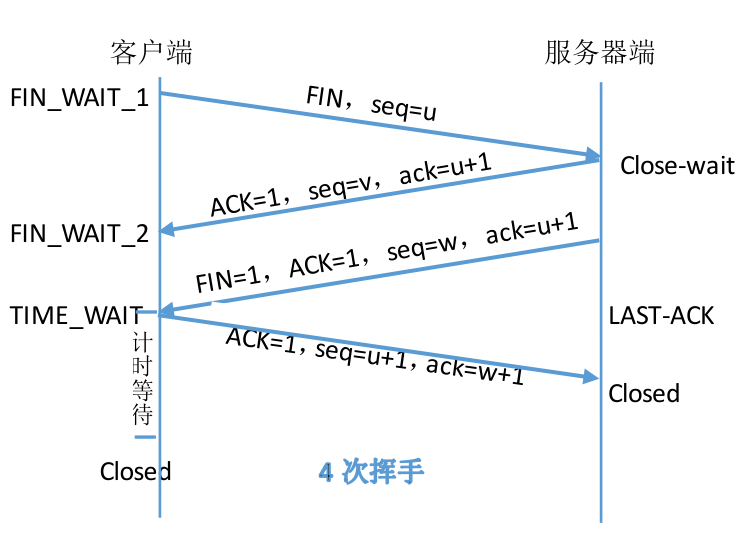

# TCP协议设计原理

　最近去了解TCP协议，发现这是一个特别值得深思的协议。在本篇博客中，不会长篇大论的给大家介绍TCP协议特点、包头格式以及TCP的连接和断开等基本原理，而是会带大家深入理解为什么要这么设计，如果不这么设计，会产生什么后果，希望能帮助大家对TCP协议的理解。TCP弥补了IP尽力而为服务的不足，实现了面向连接、高可靠性、报文按序到达、端到端流量控制。

## 常见关键词
[MSL、TTL和RTT简介](http://www.cnblogs.com/tomato0906/articles/4696792.html)

###MSL（报文最大生存时间）

MSL是Maximum Segment Lifetime英文的缩写，中文可以译为“报文最大生存时间”，**他是任何报文在网络上存在的最长时间**，超过这个时间报文将被丢弃。因为tcp报文（segment）是ip数据报（datagram）的数据部分，具体称谓请参见《数据在网络各层中的称呼》一文。

RFC 793中规定MSL为2分钟，实际应用中常用的是30秒，1分钟和2分钟等。

2MSL即两倍的MSL，TCP的TIME_WAIT状态也称为2MSL等待状态，当TCP的一端发起主动关闭，在发出最后一个ACK包后，**即第3次握手完成后发送了第四次握手的ACK包后就进入了TIME_WAIT状态，必须在此状态上停留两倍的MSL时间，等待2MSL时间主要目的是怕最后一个ACK包对方没收到，那么对方在超时后将重发第三次握手的FIN包，主动关闭端接到重发的FIN包后可以再发一个ACK应答包**。

在TIME_WAIT状态时两端的端口不能使用，要等到2MSL时间结束才可继续使用。当连接处于2MSL等待阶段时任何迟到的报文段都将被丢弃。**不过在实际应用中可以通过设置SO_REUSEADDR选项达到不必等待2MSL时间结束再使用此端口.**

### TTL（生存时间）

ip头中有一个TTL域，TTL是time to live的缩写，中文可以译为“生存时间”，**这个生存时间是由源主机设置初始值但不是存的具体时间，而是存储了一个ip数据报可以经过的最大路由数，每经过一个处理他的路由器此值就减1，当此值为0则数据报将被丢弃，同时发送ICMP报文通知源主机**。


TTL与MSL是有关系的但不是简单的相等的关系，MSL要大于等于TTL。

### RTT（客户到服务器往返所花时间）

RTT是客户到服务器往返所花时间（round-trip time，简称RTT），TCP含有动态估算RTT的算法。TCP还持续估算一个给定连接的RTT，这是因为RTT受网络传输拥塞程序的变化而变化

 

## TCP控制字段标志：URG、ACK、PSH、RST、SYN、FIN

在TCP层，有个FLAGS字段，这个字段有以下几个标识：SYN, FIN, ACK, PSH, RST, URG.
其中，对于我们日常的分析有用的就是前面的五个字段。

它们的含义是：

URG:Urget pointer is valid (紧急指针字段值有效)

SYN: 表示建立连接

FIN: 表示关闭连接

ACK: 表示响应

PSH: 表示有 DATA数据传输

RST: 表示连接重置。

​       其中，ACK是可能与SYN，FIN等同时使用的，比如SYN和ACK可能同时为1，它表示的就是建立连接之后的响应，如果只是单个的一个SYN，它表 示的只是建立连接。TCP的几次握手就是通过这样的ACK表现出来的。但SYN与FIN是不会同时为1的，因为前者表示的是建立连接，而后者表示的是断开 连接。RST一般是在FIN之后才会出现为1的情况，表示的是连接重置。一般地，当出现FIN包或RST包时，我们便认为客户端与服务器端断开了连接；而 当出现SYN和SYN＋ACK包时，我们认为客户端与服务器建立了一个连接。PSH为1的情况，一般只出现在 DATA内容不为0的包中，也就是说PSH为1表示的是有真正的TCP数据包内容被传递。

​      TCP产生 RST响应的情况（属于硬错误）:

​       四次握手不是关闭 TCP连接的唯一方法. 有时,如果主机需要尽快关闭连接(或连接超时,端口或主机不可达)，RST (Reset)包将被发送. 注意在，由于RST包不是TCP连接中的必须部分, 可以只发送RST包(即不带ACK标记). 但在正常的TCP连接中RST包可以带ACK确认标记
      1. syn发送到服务器主机，但是目的端口并未运行。则产生一个ECONRFUSED错误。客户端立即返回。比如telnet 192.168.1.55 8889，条件：55主机在局域网上并且可达（也可以换成可以到达的网络ip地址），但是8889这个端口并未使用（可能服务器已经关闭），则服务器（对 方主机tcp内核）发送一个rst相应给客户端，于是客户端立即关闭。 注意一下，如果输入的网络ip不可达的话，客户端将会持续发送syn，最后产生一个etimeout的错误，大概75秒左右。这个时候客户端的默认网关 (192.168.1.1 211.2.2.2)因为找不到下一路由，路由器（或者再过几跳的路由器）会产生一个EHOSTUNREACH响应给客户端（注 意，ENETUNREACH和EHOSTUNREACH通常被认为是一个错误，因为ENETUNREACH一般当作已过时），由于这是个软错误（有可能是 网络暂时不通造成的）。客户端会重发syn直到超时。
        所以会有 telnet 192.168.1.55 8888  主机存在，但是端口未开，ECONRFUSED错误，立刻返回
                 telnet 192.168.1.56 *     主机不存在，UNROUTETOHOST错误，立刻返回
                 telnet 211.1.1.5    *     主机不存在，etimeout错误
      2. 最简单的情况，服务器主动发送rst给客户端关闭连接。客户端read write直接返回rst错误。
      3. 服务器收到一个不存在的连接返回rst响应。比如，服务器重启之后，先前的一个已连接的客户端毫不之情的情况下,这就是半闭连接（跟半开连接最大的不同是，半闭连接是不能使用的，半开连接可以使用）。
       此时,如果客户端read的话（接收缓冲无数据）产生一个EPEERRST错误。如果客户端write的话且发送数据小于发送缓冲区剩余容量时，第一次write成功，第二次write或者read的时候就会产生一个 EPEERRST的错误。因为write发送数据是直接把要发送的数据拷贝到内核的tcp发送缓冲区就立刻返回成功的。当然拷贝之前会先检查一下tcp连 接有无错误。所以第二次发送或者接收的时候，发现连接上已经有了EPEERRST的错误，所以就返回错误（话说回来，第一次发送的数据实际上根本就没有发 送成功，对方根本就没接受它）

## 面向连接

　　一提到TCP是面向连接的协议，必然是介绍其的3次握手和4次挥手，为了说明为什么需要三次握手和四次挥手，我们还是拿两个图来说明连接建立和断开的过程。

 

- 为什么要三次握手呢？若两次握手怎样。

假设客户端发起连接请求（SYN=1,seq=client_isn），服务器端收到请求后返回消息（SYN=1,seq=server_isn,ack=client+1）连接建立。

现在说明为什么两次握手不可以。若客户端发送连接请求request1（SYN=1,seq=client_isn），这时这个请求由于网络阻塞没有及时到达服务器端，而客户端一段时间后又发送了一个连接请求request2 （SYN=1,seq=client_isn），该request2建立了连接完成了本次通信，然后断开连接。

此时客户端发送的第一个连接请求request1到达了服务器端，此时服务器端发现是一个连接请求，**服务端并不知道这是由于网络阻塞导致已经无用的连接请求**，服务器收到request1则给客户端发送消息(SYN=1,seq=server_isn,ack=client_isn+1)。如果是两次握手那么客户端在收到这条消息后则客户端和服务器端建立连接。**但客户端并不是真正想建立连接，所以不能通过两次握手就建立连接**。

- 那为什么需要四次挥手呢？如果三次挥手又会怎样。

我们假设客户端向服务器发送了断开请求，服务器在收到断开请求后也向客户端发送断开请求（FIN=1,ACK=1,seq=w,ack=u+1），客户端收到此消息后向服务器发送断开连接（ACK=1,seq=u+1,ack=w+1）。可想而知这种方法是不可行的。**因为当客户端没有数据需要发送给服务器时，客户端主动发起了断开请求，但是并不代表服务器端没有数据发给客户端。所以为了保证服务器端正常传输完数据，服务器端在收到客户端发送的断开请求后先发送一个ACK（ACK=1,seq=v,ack=u+1）给客户端，当服务器端数据传输完后发送断开请求（FIN=1,ACK=1,seq=w,ack=u+1）。**

- 不知道大家有没有注意到客户端在发送了最后一个断开请求的ACK后，又等待了2MSL的时间才关闭连接。为什么不直接关闭连接呢？

**如果客户端直接关闭连接，而此时客户端最后发送的ACK又在网络中丢失，从而可能导致服务器端的连接无法正常关闭**。

- 那为什么又要设置为2MSL呢？

1MSL表示一个IP数据报在网络中的最多存活时间。假设客户端最后发送的ACK经过将近1MSL快要到达服务器端的时候丢失了，那么服务器端在规定的时间内未收到最后客户端发送的ACK，**则服务器端重新发送最后的FIN给客户端，请求客户端重发ACK，该FIN经过1MSL到达客户端。所以如上最坏情况，如果客户端在2MSL内没有收到FIN请求，则表明服务器端已经断开连接**。

##传输高可靠性

　　不用多说，大家都知道TCP的传输可靠性是依据确认号实现的。简单说就是客户端每发送一个分段给服务器端，服务端收到后会给客户端发送一个确认号，表示服务器端收到该分段。如果客户端在RTT时间周期内未收到服务器端的确认号，则引发超时重传。因此TCP协议中需要计时器。那么问题就来了，TCP有那么多分段，是要给每一个分段都生成一个计时器吗？

　　给每个分段都生成一个计时器当然是最简单也最好理解的，每个计时器在RTT时间后到期，如果没有收到确认号则重传该分段。然而给每个分段都生成计时器将带来巨大的内存开销和调度开销。因此在实际中采取给每个TCP连接生成一个计时器，那么问题又来了，一个TCP连接有那么多分段，如何利用一个计时器管理这么多分段呢？设计原则如下（大家可以思考一下为什么这么设计）：

1. 发送TCP分段时，如果没有开启重传定时器，则开启；

2. 发送TCP分段时，如果有重传定时器开启，则不再开启；

3. 收到一个非冗余的ACK时，如果有数据在传输，重新启动重传定时器；

4. 收到一个非冗余的ACK时，如果没有数据在传输，则关闭重传定时器；

5. 如果连续收到3个冗余ACK时，则不用等到重传定时器超时，直接重传。

## 报文按序到达

　　确认号是TCP两端通信的数据传输的“标志”，TCP的发送端在收到一个确认号后，就认为接收端已经收到了该确认号之前的所有数据。早期的TCP标准中，只要TCP有一个分段丢失，该分段后的其他分段即使正确到达接收端，发送端还是会重传丢失分段后的所有分段，从而导致了大量不必要的超时重传。**现在的TCP实现了一种选择确认的方式，接收端会显示的告诉发送端重传哪些分段，不需要重传哪些分段，避免了重传风暴。**

### TCP序列号回绕的问题

不知道大家在学习TCP协议时，有没有考虑TCP序列号回绕的问题。从TCP报文头部知道序列号占32位，能传输2的32次方个字节。如果一个1Gbps的网络，TCP端1s会发送125MB的数据，从而在32s内可发送2的32次方个字节，导致序列号回绕，而32s是小于MSL值的。一旦序列号回绕会导致接收端对TCP报文的排序发生错乱。

- 当然可以通过加时间戳的方式来辅助序列号的识别，在接收端发现序列号回绕时，比较时间戳字段的值，如果回绕的序列号时间戳较大，则说明确实发生了回绕，从而将该数据放在最大的序列号之后。
- TCP还有其他方法判断序列号是否发生回绕，从而有效的确定数据报的排列顺序。

## 端到端流量控制

端到端流量控制使用滑动窗口来实现，一提到滑动窗口大家张口就来的是慢开始、拥塞避免、快重传、快恢复。

那么问题来了：

- ①快重传和快恢复确实提高了TCP的传输效率，**但是如果发送端每次发送的TCP报文中仅有少量的数据，而包含大量的报头字段，从而也会影响效率，那么如何增大发送端发送数据的大小呢**。
- ②**接收端在收到数据后返回给发送端一个ACK，如果接收端针对每个分段都返回ACK的话，网络中的ACK也会消耗大量的带宽，那么如何减少网络中ACK的发送呢**。

思路大致是两种：

1. 发送端
2. 接收端

### 如何增大发送端发送数据的大小

> 由接收端告诉发送端发送多少；发送端通过Naggle算法，累积到了一定大小再发

大家可能看到这样的长篇大论，已经没有了任何兴趣，那就放一张卡车拉煤图吧。我想通过卡车拉煤来说明如何解决这两个问题。其中括号中的是TCP中问题用拉煤的例子解释。


我们先说第一个问题，就是TCP每次携带数据量少（卡车每次都拉一点煤，都不够油钱的）的问题。TCP中为什么会存在这个问题呢？

接收端通过ack告诉发送端接收端窗口大小，决定发送端还可以发送多少数据（北京发电厂告诉山西煤场我这最多还可以接受5kg煤，你下次就送5kg煤就可以了，然后山西煤场就真的开着卡车送来了5kg煤）。

这种情况显然需要从接收端着手解决，如果接收窗口为0，则告诉发送端不要在发送数据了，只有当接收端可接受的数据达到接收窗口的一半时，再告诉发送窗口发送数据（也就是说北京发电厂已经腾出了一半的空地可放煤了，才告知山西煤场送煤）。

那还存在问题，虽然接受窗口已经有一半空闲，但是发送窗口发送的TCP携带的数据量还是较少（虽然发电厂已经有一半的地可以放煤了，但是煤场每次只送5kg煤）。**这就是发送端的问题了，从而利用Nagle算法解决发送端持续发送小块数据分段的问题。如下我们就来看看这个Nagle算法**：

[](javascript:void(0);)

```
IF 数据的大小和窗口的大小都超过了MSS
Then 发送数据分段
ELSE
  IF 还有发出的不足MSS大小的TCP分段没有收到确认
    Then 积累数据到发送队列的末尾的TCP分段
  ELSE
    发送数据分段
  EndIF
EndIF
```

[](javascript:void(0);)

### ACK消耗大量带宽

> 接收端不立即Ack,等待两个分段再Ack

第二个问题就是网络中ACK消耗大量带宽的问题（也就是说卡车把煤拉到北京，直接带着北京的口信，空着车就回山西了）。**RFC建议了一种延迟的ACK，也就是说接收端在收到数据并不立即回复ACK，而是等一段时间，看看接收端是否也有数据要发送给发送端，同时通过要发送的数据一同传输给发送端。等一段时间，可能后续的TCP分段到达，这样就可以取最大者一起返回，从而也能减少网络中ACK的数量。当然RFC的建议延迟的ACK最多等待两个分段的积累确认**。 


